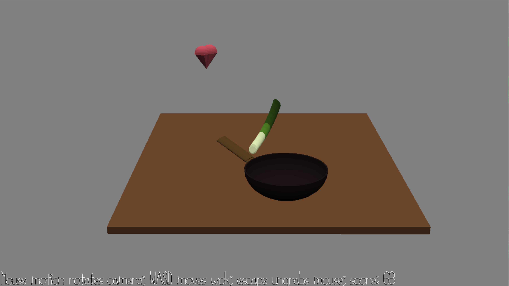

# My Heart Is in the Wok

Author: Anna Li

Design: Catch all the leeks in your wok! And if you see a heart, catch that, too -- it's even sweeter. But don't catch any rocks; no one likes a rock wok.

Screen Shot:

How To Play:

Use the WASD keys to move the wok across the table. Leeks and hearts will bump up your score, but rocks will knock it down, so get your wok away from them! The more points you get, the more that falls from the sky. You can also use the mouse to change the camera angle, but it will only help so much; you'll need to rely on your depth perception and fast reflexes more than anything :^)

Sources: All assets made by Anna Li.

This game was built with [NEST](NEST.md).

